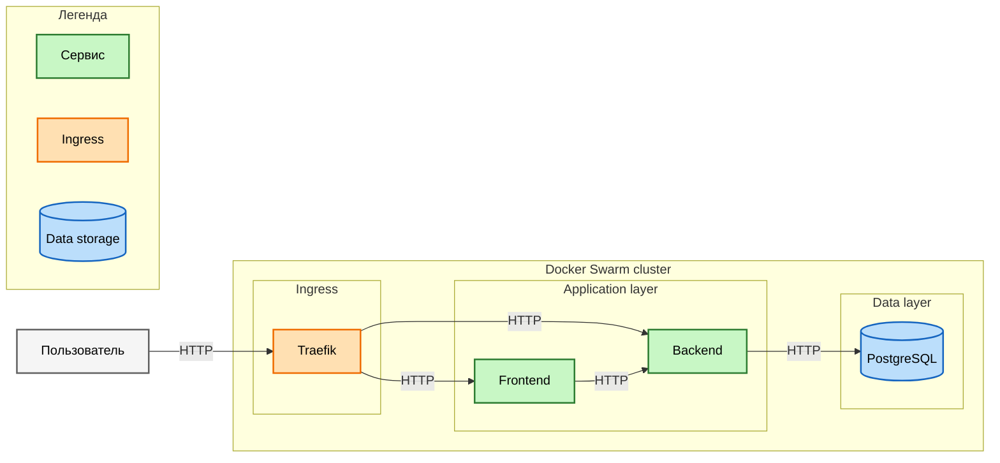
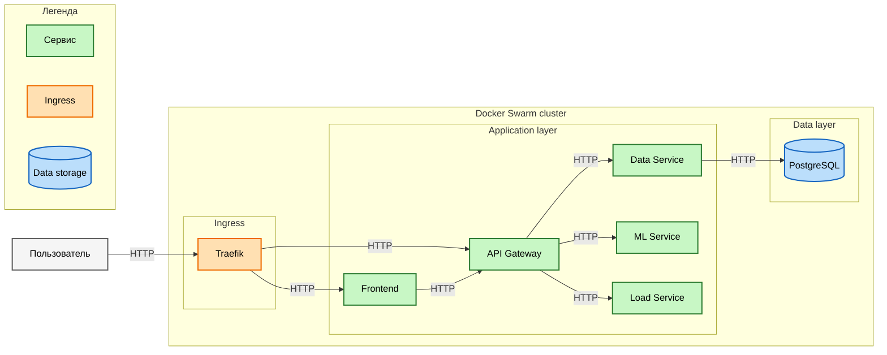

# Локальное развертывание на 1 ноде

## Сборка образов

```bash
docker build -t swarm-demo-api-gateway:latest ./api-gateway

docker build -t swarm-demo-load-service:latest ./load-service

docker build -t swarm-demo-ml-service:latest ./ml-service

docker build -t swarm-demo-data-service:latest ./data-service

docker build -t swarm-demo-frontend:latest ./frontend
```

## Добавление конфигов и секретов

```bash
echo "appdb" | docker config create pg_db_name -

echo "postgres" | docker config create pg_db_user -

echo "secret-password" | docker secret create pg_password -
```

## Секреты и конфиги для редиса

```PowerShell
docker config create redis_conf redis.conf
```

У меня на win-10 креды для редиса передавались некоректно из-за \r в конце секрета, нашел такой выход

### Сначала создадим файлы секретов

```PowerShell
$app = "app"
$pass = "secret-password"
[System.IO.File]::WriteAllText("redis_app_username.txt", $app, [System.Text.UTF8Encoding]::new($false))
[System.IO.File]::WriteAllText("redis_app_password.txt", $pass, [System.Text.UTF8Encoding]::new($false))
```

### Потом создадим из них секреты

```PowerShell
docker secret create redis_app_username redis_app_username.txt
docker secret create redis_app_password redis_app_password.txt
```

## Деплой в Swarm

```bash
docker swarm init

docker stack deploy -c stack.yml demo
```

Проверка:

```bash
docker stack services demo
docker stack ps demo
docker service logs demo_api-gateway -f
```

Приложение будет доступно по адресу:

```text
http://<IP-manager-node>:8090
```

## Удаление

```bash
docker stack rm demo
```

# Диаграмма Монолита



# Диаграмма Микросервисов


